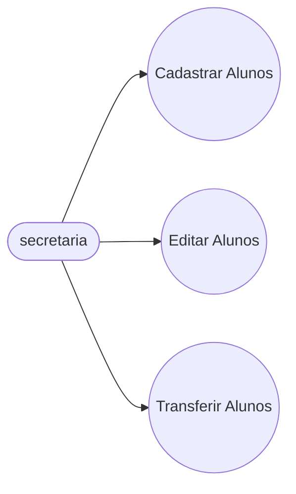
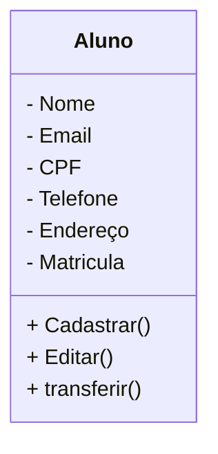

# Projeto Universidade

Modelagem em orientaçao a Objetos das Entidades Alunos, Cursos, e Turmas

# Caso de Uso

## Diagrama de Classes

## Dependencias
- **VSCode**: IDE (Interface de Desenvolvimento)
- **Mermaid**: Linguagem para Confecçao de Diagramas em Documentos .md (Mark Down)
- **Material icon theme**: tema para Colorir as Pastas.
- **GIt lens**: Interface Grafica para o Versionamento git integrado ao VSCode